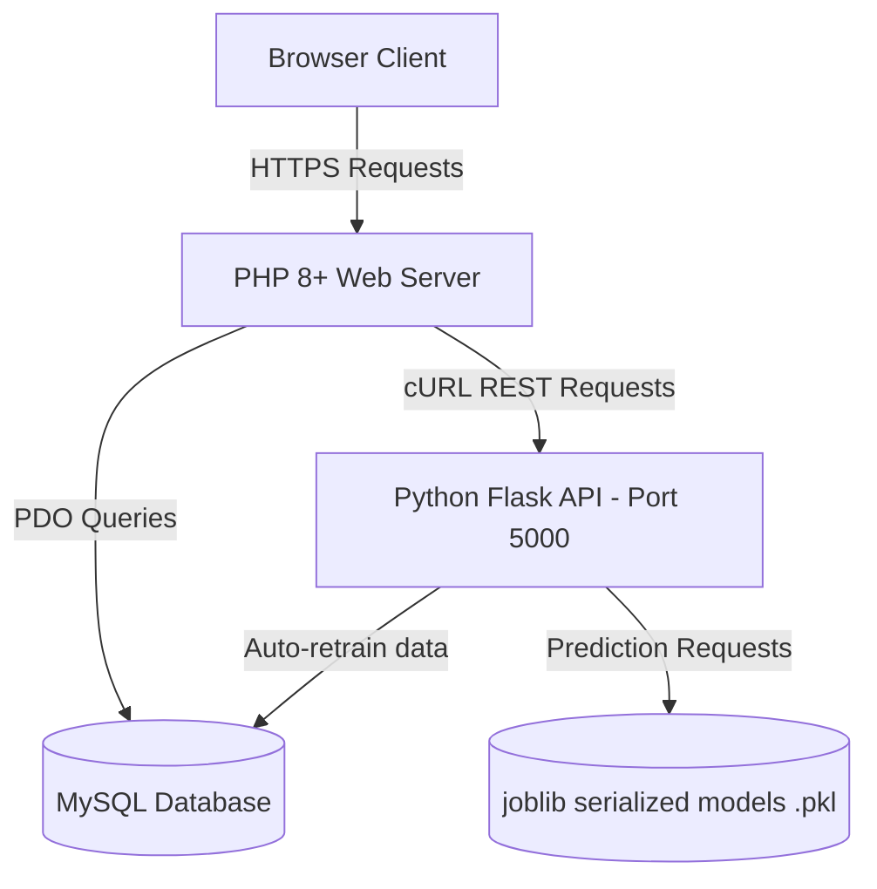
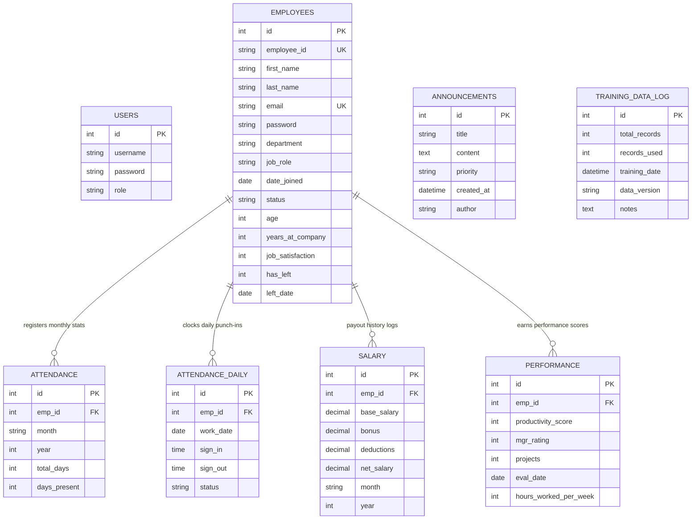

# 🖥️ Codebase Walkthrough: HR Admin & Attrition Prediction System

Welcome to the technical walkthrough of the **AI-Driven Intelligent Employee Remuneration & Attrition Prediction System**. This document outlines the system's full-stack architecture, key modules, code patterns, machine learning paradigms, database schemas, and robust security frameworks.

---

## 🏗️ 1. Architecture Overview

The application utilizes a distributed full-stack architecture consisting of a sleek, dark-themed front-end, a robust PHP 8.0 backend with isolated admin/employee session spaces, a MySQL relational database, and an isolated Python Flask Microservice running AI/ML models on demand.



### Key Subsystems:
1. **Glassmorphism UI Engine:** Modern custom Vanilla CSS implementation utilizing Tailwind-like variables but styled raw with custom transparency filters, gradient typography, state translations, and grid-responsive dashboard pages.
2. **HR Administration Core (PHP):** Handles RBAC (Role-Based Access Control), employee directories, CSV bulk uploads, attendance tracking, manager feedback logs, announcements, and payroll generation.
3. **ML Prediction Engine (Python/Flask):** Evaluates salary appropriateness, attrition threat, promotion eligibility, and categorizes high-performing or steady personnel using lightweight models loaded via `joblib`.

---

## 📁 2. File Organization & Directory Structure

Here is how the directory structure organizes specialized functional domains:

```text
├── index.php                    # System hub & client portal router
├── admin_login.php              # Secure Admin entry point
├── employee_login.php           # Secure Employee self-service login
├── dashboard.php                # Admin dashboard & analytics manager
├── employee_dashboard.php       # Employee self-service dashboard
│
├── add_employee.php             # New employee profile creation
├── view_employee.php            # Composite user profile with AI prediction summaries
├── add_salary.php               # Payroll setup & payout logs
├── salary.php                   # General salary management index
├── payslip.php                  # Interactive digital payslip generation & print view
├── send_payslip_email.php       # Custom mail trigger (SimpleMailer integration)
├── manage_attendance.php        # Granular daily attendance manager & validation
├── manage_performance.php       # Performance scoring & review logging
├── bulk_import.php              # Onboarding hub using bulk CSV files
├── import_employees.php         # CSV parse, validate, and multi-row insertion execution
├── download_template.php        # Dynamic CSV import template server
├── upload_profile_pic.php       # Upload profile photo engine (with type & size validation)
│
├── prediction.php               # AI prediction core interface
├── attrition.php                # Attrition threat evaluation workspace
├── productivity.php             # Weighted employee productivity scoring page
├── promotion.php                # Random Forest-driven promotion projection page
│
├── forgot_password.php          # OTP verification-based self-service reset flow
├── password_requests.php        # Admin dashboard for manually processing reset requests
├── logout.php                   # Admin session destruction handler
├── employee_logout.php          # Employee session destruction handler
│
├── .env                         # Secure configuration variables (SMTP credentials)
├── .gitignore                   # Version control patterns exclusion
│
├── css/
│   └── style.css                # Global UI Styling variables, glass templates & keyframes
│
├── php/
│   ├── db.php                   # MySQL PDO configuration & self-repairing migrations
│   ├── sidebar.php              # Shared admin side navigation template
│   ├── predictions.php          # cURL wrapper calling python ML service endpoints
│   ├── csrf.php                 # Double submit cookie / token verification helper
│   ├── config.php               # Key configuration and directory definitions
│   ├── email_config.php         # Parses SMTP variables from environmental configuration
│   └── SimpleMailer.php         # Native SMTP socket handler for transactional emails
│
├── python/
│   ├── app.py                   # Flask REST server and prediction routing
│   ├── train_from_db.py         # Automatic SQL dataset extractor & model retrainer
│   ├── train_from_csv.py        # Static CSV fallback dataset model retrainer
│   ├── migrate_db.py            # Diagnostic schema & index verifying script
│   ├── start_flask_server.bat   # Automated Windows environment activation script
│   ├── start_flask_server.ps1   # Automated PowerShell execution environment launcher
│   ├── requirements.txt         # Required python libraries (Flask, Pandas, scikit-learn, joblib)
│   └── venv/                    # Local Python virtual environment directory
│
├── models/
│   ├── salary_model.pkl         # Linear Regression Model weights
│   ├── attrition_model.pkl      # Logistic Regression classification boundary weights
│   ├── promotion_model.pkl      # Random Forest ensemble weights
│   └── category_model.pkl       # Multi-class Decision Tree weights
│
└── uploads/                     # Secure image storage directory for user profile avatars
```

---

## 🗄️ 3. Database Schema & Data Models

The system architecture utilizes a robust MySQL scheme ensuring absolute data integrity using strict Foreign Key constraints and `ON DELETE CASCADE` clauses.



### Monthly vs. Daily Attendance Aggregation:
The runtime tracks detailed daily logs in `attendance_daily` for real-time punch-ins and anomaly flags. Aggregation logic runs monthly to populate the core `attendance` table which acts as direct features feed for ML classification structures.

---

## 🤖 4. AI Prediction Engine Details

The Python-powered AI Engine is structured with clean data science practices. Models use **7 primary features** representing a combination of demographic, feedback, and productivity data points:
$$\mathbf{X} = \{\text{Age}, \text{YearsAtCompany}, \text{BaseSalary}, \text{JobSatisfaction}, \text{PerformanceRating}, \text{ProjectsCompleted}, \text{HoursWorkedPerWeek}\}$$

### Model Taxonomy:
1. **Salary Recommendation (Linear Regression):**
   * **Algorithm:** `LinearRegression()`
   * **Target:** Recommended Base Salary in local currency (₹).
   * **Business Goal:** Helps HR determine fair, data-backed wage levels, avoiding overpaying while maintaining market-level salaries.
2. **Attrition Risk (Logistic Regression):**
   * **Algorithm:** `LogisticRegression(max_iter=1000)`
   * **Target:** Risk probability distribution (0 - 100%).
   * **Optimization:** Leverages generated risk-factor proxies if historical attrition examples are sparse in new systems.
3. **Promotion Eligibility (Random Forest Classifier):**
   * **Algorithm:** `RandomForestClassifier(n_estimators=100, random_state=42)`
   * **Target:** Probability indicating readiness.
   * **Heuristics Feed:** Automatically logs positive recommendations when managers score $\ge 4$, total completed projects count $\ge 10$, and tenure $\ge 2$ years.
4. **Employee Categorization (Decision Tree Classifier):**
   * **Algorithm:** `DecisionTreeClassifier(max_depth=6, random_state=42)`
   * **Target:** Multi-class target: `Underperformer` ($0$), `Steady` ($1$), or `High Potential` ($2$).
   * **Business Logic:** Helps HR isolate underperformers needing training versus critical high-potential talents.

### Model Training Loop (`train_from_db.py`):
This script provides live feedback when executed. It connects directly to MySQL, extracts full historical matrices via SQL joins, builds feature vector structures, fits models, serializes current states to `.pkl` formats, and logs results:

```python
# Extract from train_from_db.py
query = """
    SELECT 
        e.age AS Age, 
        e.years_at_company AS YearsAtCompany, 
        s.base_salary AS BaseSalary, 
        e.job_satisfaction AS JobSatisfaction, 
        p.mgr_rating AS PerformanceRating, 
        p.projects AS ProjectsCompleted, 
        p.hours_worked_per_week AS HoursWorkedPerWeek,
        e.has_left,
        p.mgr_rating,
        p.projects,
        e.years_at_company
    FROM employees e
    LEFT JOIN salary s ON e.id = s.emp_id
    LEFT JOIN performance p ON e.id = p.emp_id
"""
# Models are trained, accuracy metric computed via train_test_split and dumped to '../models/'
```

---

## 🔌 5. Inter-Service Communication Flow (PHP Client)

All predictive calls leverage the native `call_flask_api` function defined in `php/predictions.php`. This leverages PHP curl channels, mapping parameters to the API endpoints and setting clean safety mechanisms.

```php
// call_flask_api inside php/predictions.php
function call_flask_api($endpoint, $data) {
    $url = "http://127.0.0.1:5000" . $endpoint;
    $ch = curl_init($url);
    $payload = json_encode($data);
    curl_setopt($ch, CURLOPT_RETURNTRANSFER, true);
    curl_setopt($ch, CURLINFO_HEADER_OUT, true);
    curl_setopt($ch, CURLOPT_POST, true);
    curl_setopt($ch, CURLOPT_POSTFIELDS, $payload);
    curl_setopt($ch, CURLOPT_HTTPHEADER, [
        'Content-Type: application/json',
        'Content-Length: ' . strlen($payload)
    ]);
    curl_setopt($ch, CURLOPT_TIMEOUT, 5); // Prevents PHP from hanging if Flask server goes offline
    
    $result = curl_exec($ch);
    $httpcode = curl_getinfo($ch, CURLINFO_HTTP_CODE);
    curl_close($ch);
    
    if ($httpcode >= 200 && $httpcode < 300 && $result) {
        return json_decode($result, true);
    }
    return null;
}
```

---

## 🔒 6. Comprehensive Security Implementations

Security is prioritized across both portals through multi-layered defensive controls:

| Security Vector | Implementation Detail | Location |
| :--- | :--- | :--- |
| **Password Protection** | Handled using `password_hash()` and verified with `password_verify()` using strong Bcrypt algorithms. | `admin_login.php`, `employee_login.php` |
| **CSRF Defense** | Generates cryptographically secure random values (`bin2hex(random_bytes(32))`) saved to sessions, validating tokens on all POST updates. | `php/csrf.php` |
| **XSS Prevention** | Recursively escapes output text variables using custom standard `htmlspecialchars(..., ENT_QUOTES, 'UTF-8')`. | Throughout template rendering |
| **Isolated Sessions** | Uses separate session identifier namespaces to block session crossing. Admin sessions use default `PHPSESSID` while employee portal uses custom `emp_sess`. | Core authentication loaders |

---

## 🎨 7. Premium Glassmorphic Design Details

The application is styled with a futuristic glassmorphic theme defined in `css/style.css`. 

### key CSS system features:
* **Rich Color Tokens:** Avoids default primary colors, utilizing `#4F46E5` (Primary Indigo), `#10B981` (Emerald Secondary), `#0F172A` (Slate Dark), and soft border parameters (`rgba(255, 255, 255, 0.1)`).
* **Glass Panel Template:**
  ```css
  .glass-panel {
      background: rgba(30, 41, 59, 0.7);
      backdrop-filter: blur(12px);
      -webkit-backdrop-filter: blur(12px);
      border: 1px solid rgba(255, 255, 255, 0.1);
      border-radius: 12px;
      box-shadow: 0 4px 6px -1px rgba(0, 0, 0, 0.5);
  }
  ```
* **Dynamic Animations:** Fluid entry animations (`@keyframes fadeIn`) applied to panels and notifications, resulting in highly premium interface transitions.

---

## 🔍 8. Diagnostic & Verification Steps

Ensure the implementation runs smoothly with these simple diagnostics:
1. **Flask API Health Check:** Send a GET request to `http://localhost:5000/`. A healthy response will return a listing of endpoints and an `"online"` status.
2. **Auto-Migration Verification:** Upon the first database call, `php/db.php` checks if required tables exist, automatically applying schema statements to make startup seamless.
3. **Email Verification:** SimpleMailer directly logs raw SMTP socket transactions, making it easy to isolate and resolve SMTP mail dispatch issues.

---

*This concludes the technical walkthrough. For questions regarding model retuning or customized dataset loading, consult the [README.md](file:///c:/xampp/htdocs/16-5/README.md) file.*
